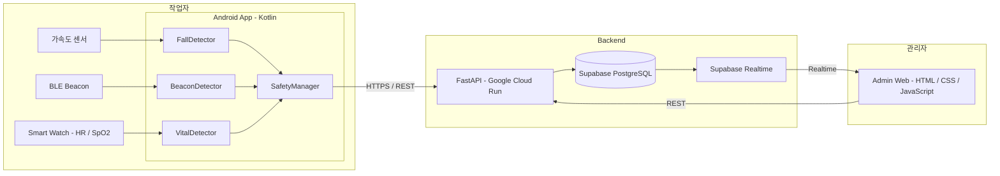
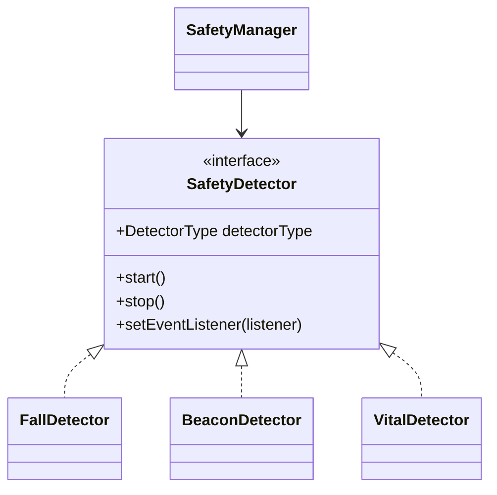

# 작업자 안전 모니터링 시스템 아키텍처

## 1. 전체 아키텍처



전체 데이터 흐름:

**Sensor / IoT → Kotlin Detector → SafetyManager → FastAPI → Supabase →
관리자 Web**

------------------------------------------------------------------------

## 2. Android 감지 모듈

낙상 감지, 구역 접근 감지, 생체신호 감지는 사용하는 센서와 판단 방식이
다르므로 독립적인 클래스로 구현한다.

세 기능을 애플리케이션에서 동일한 방식으로 관리하기 위해 공통
`SafetyDetector` 인터페이스를 정의한다.



### SafetyDetector

모든 감지 모듈이 구현해야 하는 공통 인터페이스이다.

```kotlin
interface SafetyDetector {
    val detectorType: DetectorType

    fun start()
    fun stop()

    fun setEventListener(
        listener: (SafetyEvent) -> Unit
    )
}
```

| 구성 | 역할 |
| --- | --- |
| `detectorType` | 감지 모듈 종류 식별 |
| `start()` | 센서 또는 IoT 장치 모니터링 시작 |
| `stop()` | 모니터링 종료 및 자원 해제 |
| `setEventListener()` | 위험 상황 발생 시 `SafetyEvent` 전달 |

```kotlin
enum class DetectorType {
    FALL,
    BEACON,
    VITAL
}
```

각 기능 담당자는 `SafetyDetector`를 구현한다.

```kotlin
class FallDetector : SafetyDetector {
    // 가속도 센서 및 낙상 판단
}

class BeaconDetector : SafetyDetector {
    // BLE Beacon 스캔 및 접근 판단
}

class VitalDetector : SafetyDetector {
    // 심박수 / SpO2 수집 및 이상 판단
}
```

각 Detector 내부의 센서 접근 방식과 판단 알고리즘은 독립적으로 구현하며,
외부에서는 모두 `SafetyDetector` 타입으로 동일하게 관리한다.

------------------------------------------------------------------------

## 3. SafetyEvent

모든 Detector는 위험 상황을 감지하면 공통 형식인 `SafetyEvent`를
생성한다.

```kotlin
data class SafetyEvent(
    val type: DetectorType,
    val severity: Severity,
    val message: String,
    val timestamp: Long = System.currentTimeMillis()
)

enum class Severity {
    LOW,
    MEDIUM,
    HIGH,
    CRITICAL
}
```

각 Detector의 내부 구현과 관계없이 최종 출력은 `SafetyEvent`로 통일한다.

------------------------------------------------------------------------

## 4. SafetyManager

`SafetyManager`는 모든 `SafetyDetector`를 등록하고 관리한다.

```kotlin
class SafetyManager(
    private val detectors: List<SafetyDetector>
) {
    fun startMonitoring() {
        detectors.forEach { detector ->
            detector.setEventListener { event ->
                handleEvent(event)
            }
            detector.start()
        }
    }

    fun stopMonitoring() {
        detectors.forEach { it.stop() }
    }

    private fun handleEvent(event: SafetyEvent) {
        // 앱 내부 위험 처리
        // 서버 전송
    }
}
```

각 감지 기능 담당자의 공통 구현 규칙:

> `SafetyDetector` 인터페이스를 구현하고, 위험 상황을 감지하면
> `SafetyEvent`를 발생시킨다.

------------------------------------------------------------------------

## 5. 백엔드 및 관리자 인터페이스

### Backend

**FastAPI + Google Cloud Run**

-   Android 애플리케이션의 REST API 요청 수신
-   요청 데이터 검증 및 위험 이벤트 처리
-   Supabase 데이터 저장 및 조회
-   관리자용 API 제공

### Supabase

-   PostgreSQL 기반 데이터 저장
-   사용자 인증
-   Realtime 기반 실시간 이벤트 전달

### 관리자 Web

**HTML / CSS / Vanilla JavaScript**

-   작업자 상태 확인
-   심박수 및 SpO2 확인
-   위험 이벤트 실시간 확인
-   위험 이벤트 이력 조회

위험 이벤트 처리 흐름:

**Sensor → SafetyDetector → SafetyEvent → SafetyManager → FastAPI →
Supabase → Admin Web**

------------------------------------------------------------------------

## 6. 기술 스택

| 영역 | 기술 |
| --- | --- |
| Mobile | Android / Kotlin |
| 낙상 감지 | Accelerometer |
| 구역 접근 감지 | BLE Beacon |
| 생체신호 | Smart Watch / Heart Rate / SpO2 |
| Backend | Python / FastAPI |
| Backend Hosting | Google Cloud Run |
| Database | Supabase PostgreSQL |
| Authentication | Supabase Auth |
| Realtime | Supabase Realtime |
| Admin Frontend | HTML / CSS / Vanilla JavaScript |
| 통신 | HTTPS / REST / JSON |
